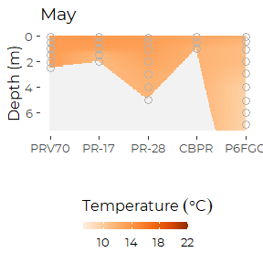
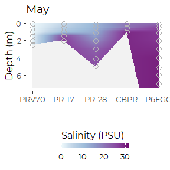
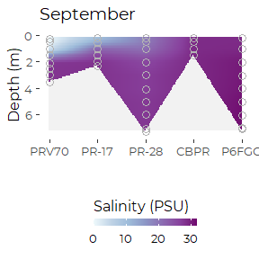
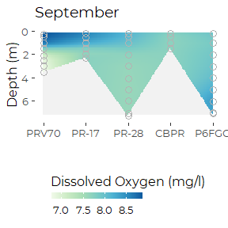

Graphics From DEP Presumpscot Transect
================
Curtis C. Bohlen, Casco Bay Estuary Partnership.
06/16/2021

-   [Introduction](#introduction)
-   [Folder References](#folder-references)
-   [Load Data](#load-data)
-   [Summary of Metadata](#summary-of-metadata)
    -   [QA/QC Samples](#qaqc-samples)
    -   [Censoring Flags](#censoring-flags)
    -   [Units](#units)
-   [Presumpscot Transect Sites](#presumpscot-transect-sites)
-   [Review of Presumpscot Data](#review-of-presumpscot-data)
    -   [How often was each site
        sampled?](#how-often-was-each-site-sampled)
-   [Presumpscort Estuary Series](#presumpscort-estuary-series)
    -   [Maximum Depths, 2018](#maximum-depths-2018)
    -   [May](#may)
        -   [Temperature](#temperature)
        -   [Salinity](#salinity)
        -   [Dissolved Oxygen](#dissolved-oxygen)
    -   [September](#september)
        -   [Temperature](#temperature-1)
        -   [Salinity](#salinity-1)
        -   [Dissolved Oxygen](#dissolved-oxygen-1)
        -   [Dissolved Oxygen, September, Short Color
            Scale](#dissolved-oxygen-september-short-color-scale)


# Introduction

Sonde “downcast” data generates a huge volume of data, which can be
difficult to analyze or summarize. Consequently, the data is often
presented largely in graphical form. Formal statistical analyses are of
less interest, as we expect variation by depth, time, and location.
Unexplained variation is also fairly common.

Here we focus on producing graphical summaries of the DEP sonde downcast
data from a transect from the head of tida at the Presumpscot Estuary to
Fort Gorges.

1.  Variation by time of year for each site and year, and

We make use of a small graphics package we produced, `tdggraph`, that
encapsulates logic needed to generate the necessary graphics

\#Load libraries

``` r
#library(readxl)
library(tidyverse)
#> Warning: package 'tidyverse' was built under R version 4.0.5
#> -- Attaching packages --------------------------------------- tidyverse 1.3.1 --
#> v ggplot2 3.3.5     v purrr   0.3.4
#> v tibble  3.1.6     v dplyr   1.0.7
#> v tidyr   1.1.4     v stringr 1.4.0
#> v readr   2.1.0     v forcats 0.5.1
#> Warning: package 'ggplot2' was built under R version 4.0.5
#> Warning: package 'tidyr' was built under R version 4.0.5
#> Warning: package 'dplyr' was built under R version 4.0.5
#> Warning: package 'forcats' was built under R version 4.0.5
#> -- Conflicts ------------------------------------------ tidyverse_conflicts() --
#> x dplyr::filter() masks stats::filter()
#> x dplyr::lag()    masks stats::lag()

library(CBEPgraphics)
load_cbep_fonts()
theme_set(theme_cbep())

library(tdggraph)    # CBEP package for time-depth "profile" graphics
```

# Folder References

``` r
sibfldnm <- 'Data'
parent <- dirname(getwd())
sibling <- paste(parent,sibfldnm, sep = '/')

dir.create(file.path(getwd(), 'figures'), showWarnings = FALSE)
```

# Load Data

``` r
sonde_data <- read_csv(file.path(sibling, 'dep_sonde_data.csv')) %>%
  mutate(yearf = factor(year))
#> Rows: 2679 Columns: 16
#> -- Column specification --------------------------------------------------------
#> Delimiter: ","
#> chr   (3): site_name, site, month
#> dbl  (10): year, hour, depth, temp, salinity, ph, pctsat, do, chl_a_sonde, t...
#> lgl   (1): turbidity_cens
#> date  (1): dt
#> time  (1): time
#> 
#> i Use `spec()` to retrieve the full column specification for this data.
#> i Specify the column types or set `show_col_types = FALSE` to quiet this message.
```

# Summary of Metadata

## QA/QC Samples

We conducted no analysis of QA/QC samples, and simply deleted then from
the data to avoid confusion.

## Censoring Flags

While preparing our working data, we separated raw observations from
text annotations, including data quality flags. IN the sonde-related
data, we only had to contend with (1) left censoring of turbidity data ,
and (2) data quality flags on all chlorophyll data.

Since all sonde-related chlorophyll data was flagged as of questionable
accuracy (with “J” flags), it does us no good to track that information
during further analysis. We retain all data, but recognize that it’s
accuracy is suspect, especially in comparison to laboratory results. We
believe the “J” flags reflect the fact that these are “raw” estimates of
chlorophyll based only on observed florescence, never recalibarated
based on laboratory samples.

We also had a few “U&lt;” flags in the Turbidity data. We separated out
a `TRUE` / `FALSE` flag to indicated censored values, with the name
’turbidity\_cens\`.

## Units

Our derived data files lack any indication of units. Units were
documented in the source Excel files. We summarize relevant information
here.

| Variable Name | Meaning                                         | Units                       |
|---------------|-------------------------------------------------|-----------------------------|
| site\_name    | DEP “Site ID”                                   |                             |
| site          | DEP “Sample Point ID” without depth designation |                             |
| dt            | Date of sample collection                       | yyyy-mm-dd format           |
| month         | Month, derived from date                        | Three letter codes          |
| year          | Year, derived from date                         |                             |
| time          | time of sample                                  | 24 hour clock, hh:mm format |
| hour          | hour, derived from time                         |                             |
| depth         | Sample Depth                                    | Meters                      |
| temp          | Water Temperature                               | DEG C                       |
| salinity      | Salinity                                        | PPTH                        |
| ph            | pH                                              |                             |
| pctsat        | Dissolved Oxygen Saturation                     | %                           |
| do            | Dissolved Oxygen                                | MG/L                        |
| turbidity     | Turbidity                                       | NTU                         |
| chl\_a\_sonde | Chlorophyll A, measured with a sonde            | UG/L                        |

# Presumpscot Transect Sites

``` r
pr_transect_sites <- sonde_data %>%
  filter(grepl('PR', site) | grepl('P6FG', site)) %>%
  select(site, site_name) %>%
  unique() %>%
  pull(site)
pr_transect <- pr_transect_sites[c(5,3,4,2,1)]
pr_transect
#> [1] "PRV70" "PR-17" "PR-28" "CBPR"  "P6FGG"

pr_data <- sonde_data %>%
  filter(site %in% pr_transect)
rm(pr_transect_sites, pr_transect)
```

# Review of Presumpscot Data

## How often was each site sampled?

We make an assumption here that sampling on one day is related.

``` r
tmp <- pr_data %>%
  group_by(site, year) %>%
  summarize(was_sampled = sum(! is.na(depth)) > 1,
            .groups = 'drop')
xt <- xtabs(~ year + site, data = tmp)
rowSums(xt)
#> 2017 2018 2019 2020 
#>    4    5    5    4
rm(xt)
```

So, DEP sampled all five sites in 2018 and 2019.

# Presumpscort Estuary Series

``` r
pr_data <- pr_data %>%
  rename(dates = dt) %>%
  #filter(year == 2018) %>%
  mutate(site = factor(site, 
                       levels = c('PRV70', 'PR-17', 
                                  'PR-28', 'CBPR', 'P6FGG')),
         sitenum = as.numeric(site))   # Needed for plotting
```

## Maximum Depths, 2018

``` r
pr_data %>%
  filter(year == 2018) %>%
  group_by(site) %>%
  summarize(maxdepth = max(depth, na.rm = TRUE))
#> # A tibble: 5 x 2
#>   site  maxdepth
#>   <fct>    <dbl>
#> 1 PRV70     6.06
#> 2 PR-17     4.58
#> 3 PR-28     8.64
#> 4 CBPR      3.32
#> 5 P6FGG    17.5
```

## May

``` r
tmp1 <- pr_data %>%
  filter(year == 2018) %>%
  filter(dates == min(dates))
```

### Temperature

``` r
ptsmooth(tmp1, .x  = sitenum,  .y  = depth,  .val = temp, 
         .res_x = 0.01, .res_y = .1,
         y_grow_grid = FALSE, y_with_zero = FALSE) +
  scale_fill_distiller(palette = 7, direction = 2, 
                      limits = c(7, 22),
                      na.value = 'gray95'
                                  ) +
  theme_cbep(base_size = 12) +
  theme(legend.position = 'bottom') +
  guides(fill = guide_colorbar(title = expression(Temperature ~ ( degree * C)), 
                               title.position = 'top',
                               barheight = unit(0.2, 'cm'))) +

  geom_point(mapping = aes(sitenum, depth), data= tmp1,
             shape = 21, fill = NA, color = 'gray70', size = 3) +
  scale_x_continuous(breaks = 1:5, 
                     labels = levels(tmp1$site)) +
  ylim(7.5,0) +
  
  xlab('') +
  ylab('Depth (m)') +
  ggtitle('May')
#> Scale for 'y' is already present. Adding another scale for 'y', which will
#> replace the existing scale.
#> Warning: Removed 39298 rows containing missing values (geom_tile).
#> Warning: Removed 7 rows containing missing values (geom_point).
```



``` r
ggsave('figures/presumpscot_may_temp.pdf', device = cairo_pdf, 
       width = 3, height = 3)
#> Warning: Removed 39298 rows containing missing values (geom_tile).

#> Warning: Removed 7 rows containing missing values (geom_point).
#ggsave('figures/presumpscot_may_temp.svg', width = 3, height = 3)
```

### Salinity

``` r
ptsmooth(tmp1, .x  = sitenum,  .y  = depth,  .val = salinity, 
         .res_x = 0.01, .res_y = .1,
         y_grow_grid = FALSE, y_with_zero = FALSE) +
  scale_fill_distiller(palette = 3, direction = 2, 
                      limits = c(0, 32),
                      na.value = 'gray95'
                                  ) +
  theme_cbep(base_size = 12) +
  theme(legend.position = 'bottom') +
  guides(fill = guide_colorbar(title = 'Salinity (PSU)', 
                               title.position = 'top',
                               barheight = unit(0.2, 'cm'))) +

  geom_point(mapping = aes(sitenum, depth), data= tmp1,
             shape = 21, fill = NA, color = 'gray70', size = 3) +
  scale_x_continuous(breaks = 1:5, 
                     labels = c('PRV70', 'PR-17', 'PR-28', 'CBPR', 'P6FGG')) +
  ylim(7.5,0) +

  xlab('') +
  ylab('Depth (m)') +
  ggtitle('May')
#> Scale for 'y' is already present. Adding another scale for 'y', which will
#> replace the existing scale.
#> Warning: Removed 39298 rows containing missing values (geom_tile).
#> Warning: Removed 7 rows containing missing values (geom_point).
```


``` r
ggsave('figures/presumpscot_may_salinity.pdf', device = cairo_pdf, 
       width = 3, height = 3)
#> Warning: Removed 39298 rows containing missing values (geom_tile).

#> Warning: Removed 7 rows containing missing values (geom_point).
```

### Dissolved Oxygen

``` r
ptsmooth(tmp1, .x  = sitenum,  .y  = depth,  .val = do, 
         .res_x = 0.01, .res_y = .1,
         y_grow_grid = FALSE, y_with_zero = FALSE) +
  scale_fill_distiller(palette = 4, direction = 2, 
                        limits = c(6, 11),
                        na.value = 'gray95',
                                  ) +
  theme_cbep(base_size = 12) +
  theme(legend.position = 'bottom') +
  guides(fill = guide_colorbar(title = 'Dissolved Oxygen (mg/l)', 
                               title.position = 'top',
                               barheight = unit(0.2, 'cm'))) +
  
  geom_point(mapping = aes(sitenum, depth), data= tmp1,
             shape = 21, fill = NA, color = 'gray70', size = 3) +
  scale_x_continuous(breaks = 1:5, 
                     labels = c('PRV70', 'PR-17', 'PR-28', 'CBPR', 'P6FGG')) +
  ylim(7.5,0) +

  xlab('') +
  ylab('Depth (m)') +
  ggtitle('May')
#> Scale for 'y' is already present. Adding another scale for 'y', which will
#> replace the existing scale.
#> Warning: Removed 39298 rows containing missing values (geom_tile).
#> Warning: Removed 7 rows containing missing values (geom_point).
```


``` r
ggsave('figures/presumpscot_may_oxygen.pdf', device = cairo_pdf, 
       width = 3, height = 3)
#> Warning: Removed 39298 rows containing missing values (geom_tile).

#> Warning: Removed 7 rows containing missing values (geom_point).
```

## September

``` r
tmp2 <- pr_data %>%
  filter(year == 2018) %>%
  filter(month == 'Sep')
```

### Temperature

``` r
ptsmooth(tmp2, .x  = sitenum,  .y  = depth,  .val = temp, 
         .res_x = 0.01, .res_y = .1,
         y_grow_grid = FALSE, y_with_zero = FALSE) +
  
  scale_fill_distiller(palette = 7, direction = 2, 
                        limits = c(7, 22),
                        na.value = 'gray95',
                                  ) +
  theme_cbep(base_size = 12) +
  theme(legend.position = 'bottom') +
  guides(fill = guide_colorbar(title = 'Temperature (C)', 
                               title.position = 'top',
                               barheight = unit(0.2, 'cm'))) +
  
  geom_point(mapping = aes(sitenum, depth), data= tmp2,
             shape = 21, fill = NA, color = 'gray70', size = 3) +
  scale_x_continuous(breaks = 1:5, 
                     labels = levels(tmp2$site)) +
  ylim(7.5,0) +

  xlab('') +
  ylab('Depth (m)') +
  ggtitle('September')
#> Scale for 'y' is already present. Adding another scale for 'y', which will
#> replace the existing scale.
```



``` r
ggsave('figures/presumpscot_sept_temp.pdf', device = cairo_pdf, 
       width = 3, height = 3)
```

### Salinity

``` r
ptsmooth(tmp2, .x  = sitenum,  .y  = depth,  .val = salinity, 
         .res_x = 0.01, .res_y = .1,
         y_grow_grid = FALSE, y_with_zero = FALSE) +
  scale_fill_distiller(palette = 3, direction = 2, 
                      limits = c(0, 32),
                      na.value = 'gray95'
                                  ) +
  theme_cbep(base_size = 12) +
  theme(legend.position = 'bottom') +
  guides(fill = guide_colorbar(title = 'Salinity (PSU)', 
                               title.position = 'top',
                               barheight = unit(0.2, 'cm'))) +

  geom_point(mapping = aes(sitenum, depth), data= tmp2,
             shape = 21, fill = NA, color = 'gray70', size = 3) +
  scale_x_continuous(breaks = 1:5, 
                     labels = c('PRV70', 'PR-17', 'PR-28', 'CBPR', 'P6FGG')) +
  ylim(7.5,0) +

  xlab('') +
  ylab('Depth (m)') +
  ggtitle('September')
#> Scale for 'y' is already present. Adding another scale for 'y', which will
#> replace the existing scale.
```



``` r
ggsave('figures/presumpscot_sept_salinity.pdf', device = cairo_pdf, 
       width = 3, height = 3)
```

### Dissolved Oxygen

``` r
ptsmooth(tmp2, .x  = sitenum,  .y  = depth,  .val = do, 
         .res_x = 0.01, .res_y = .1,
         y_grow_grid = FALSE, y_with_zero = FALSE) +
  scale_fill_distiller(palette = 4, direction = 2, 
                        limits = c(6, 11),
                        na.value = 'gray95',
                                  ) +
  theme_cbep(base_size = 12) +
  theme(legend.position = 'bottom') +
  guides(fill = guide_colorbar(title = 'Dissolved Oxygen (mg/l)', 
                               title.position = 'top',
                               barheight = unit(0.2, 'cm'))) +
  
  geom_point(mapping = aes(sitenum, depth), data= tmp2,
             shape = 21, fill = NA, color = 'gray70', size = 3) +
  scale_x_continuous(breaks = 1:5, 
                     labels = c('PRV70', 'PR-17', 'PR-28', 'CBPR', 'P6FGG')) +
  ylim(7.5,0) +

  xlab('') +
  ylab('Depth (m)') +
  ggtitle('September')
#> Scale for 'y' is already present. Adding another scale for 'y', which will
#> replace the existing scale.
```


``` r
ggsave('figures/presumpscot_sept_oxygen.pdf', device = cairo_pdf, 
       width = 3, height = 3)
```

### Dissolved Oxygen, September, Short Color Scale

``` r
ptsmooth(tmp2, .x  = sitenum,  .y  = depth,  .val = do, 
         .res_x = 0.01, .res_y = .1,
         y_grow_grid = FALSE, y_with_zero = FALSE) +
  scale_fill_distiller(palette = 4, direction = 2, 
                        #limits = c(6, 11),
                        na.value = 'gray95',
                                  ) +
  theme_cbep(base_size = 12) +
  theme(legend.position = 'bottom') +
  guides(fill = guide_colorbar(title = 'Dissolved Oxygen (mg/l)', 
                               title.position = 'top',
                               barheight = unit(0.2, 'cm'))) +
  
  geom_point(mapping = aes(sitenum, depth), data= tmp2,
             shape = 21, fill = NA, color = 'gray70', size = 3) +
  scale_x_continuous(breaks = 1:5, 
                     labels = c('PRV70', 'PR-17', 'PR-28', 'CBPR', 'P6FGG')) +
  ylim(7.5,0) +

  xlab('') +
  ylab('Depth (m)') +
  ggtitle('September')
#> Scale for 'y' is already present. Adding another scale for 'y', which will
#> replace the existing scale.
```



``` r
ggsave('figures/presumpscot_sept_oxygen_alt.pdf', device = cairo_pdf, 
       width = 3, height = 3)
```
