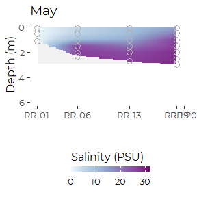
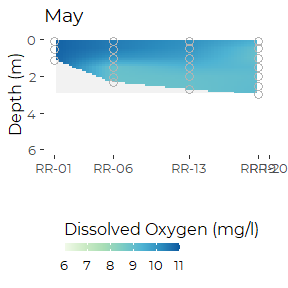
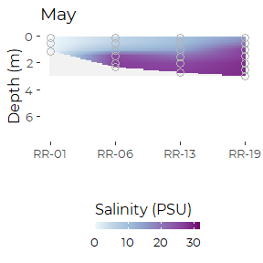
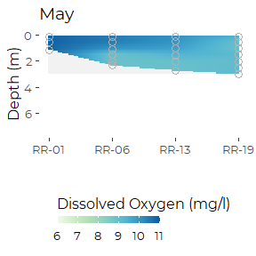
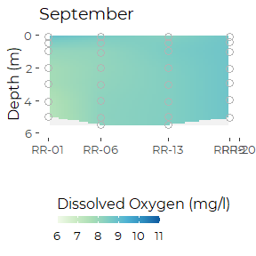
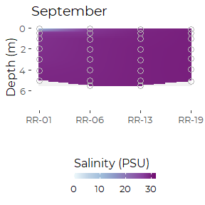
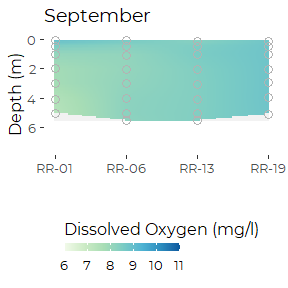

Graphics From DEP Royal Transect
================
Curtis C. Bohlen, Casco Bay Estuary Partnership.
06/16/2021

-   [Introduction](#introduction)
-   [Folder References](#folder-references)
-   [Load Data](#load-data)
-   [Summary of Metadata](#summary-of-metadata)
    -   [QA/QC Samples](#qaqc-samples)
    -   [Censoring Flags](#censoring-flags)
    -   [Units](#units)
-   [Make Data Subsets](#make-data-subsets)
-   [Royal River Transects](#royal-river-transects)
-   [Presumpscot Transect Sites (Not
    Run)](#presumpscot-transect-sites-not-run)
-   [Fore River Transect Sites (Not
    Run)](#fore-river-transect-sites-not-run)
-   [Review of Royal River Data](#review-of-royal-river-data)
    -   [How often was each site
        sampled?](#how-often-was-each-site-sampled)
-   [Royal Estuary Series](#royal-estuary-series)
    -   [Maximum Depths, 2017](#maximum-depths-2017)
    -   [May](#may)
        -   [Temperature](#temperature)
        -   [Salinity](#salinity)
        -   [Dissolved Oxygen](#dissolved-oxygen)
    -   [September](#september)
        -   [Temperature](#temperature-1)
        -   [Salinity](#salinity-1)
        -   [Dissolved Oxygen, September](#dissolved-oxygen-september)


# Introduction

Sonde “downcast” data generates a huge volume of data, which can be
difficult to analyze or summarize. Consequently, the data is often
presented largely in graphical form. Formal statistical analyses are of
less interest, as we expect variation by depth, time, and location.
Unexplained variation is also fairly common.

Here we focus on producing graphical summaries of the DEP sonde downcast
data from a transect from the head of tida at the Presumpscot Estuary to
Fort Gorges.

1.  Variation by time of year for each site and year, and

We make use of a small graphics package we produced, `tdggraph`, that
encapsulates logic needed to generate the necessary graphics

\#Load libraries

``` r
#library(readxl)
library(tidyverse)
#> Warning: package 'tidyverse' was built under R version 4.0.5
#> -- Attaching packages --------------------------------------- tidyverse 1.3.1 --
#> v ggplot2 3.3.3     v purrr   0.3.4
#> v tibble  3.1.2     v dplyr   1.0.6
#> v tidyr   1.1.3     v stringr 1.4.0
#> v readr   1.4.0     v forcats 0.5.1
#> Warning: package 'tidyr' was built under R version 4.0.5
#> Warning: package 'dplyr' was built under R version 4.0.5
#> Warning: package 'forcats' was built under R version 4.0.5
#> -- Conflicts ------------------------------------------ tidyverse_conflicts() --
#> x dplyr::filter() masks stats::filter()
#> x dplyr::lag()    masks stats::lag()

library(CBEPgraphics)
load_cbep_fonts()
theme_set(theme_cbep())

library(tdggraph)    # CBEP package for time-depth "profile" graphics
```

# Folder References

``` r
sibfldnm <- 'Derived_Data'
parent <- dirname(getwd())
sibling <- paste(parent,sibfldnm, sep = '/')

dir.create(file.path(getwd(), 'figures'), showWarnings = FALSE)
```

# Load Data

``` r
sonde_data <- read_csv(file.path(sibling, 'dep_sonde_data.csv')) %>%
  mutate(yearf = factor(year)) %>%
  mutate(month = factor(month,levels = month.abb))
#> 
#> -- Column specification --------------------------------------------------------
#> cols(
#>   site_name = col_character(),
#>   site = col_character(),
#>   dt = col_date(format = ""),
#>   month = col_character(),
#>   year = col_double(),
#>   time = col_time(format = ""),
#>   hour = col_double(),
#>   depth = col_double(),
#>   temp = col_double(),
#>   salinity = col_double(),
#>   ph = col_double(),
#>   pctsat = col_double(),
#>   do = col_double(),
#>   chl_a_sonde = col_double(),
#>   turbidity = col_double(),
#>   turbidity_cens = col_logical()
#> )
```

# Summary of Metadata

## QA/QC Samples

We conducted no analysis of QA/QC samples, and simply deleted then from
the data to avoid confusion.

## Censoring Flags

While preparing our working data, we separated raw observations from
text annotations, including data quality flags. IN the sonde-related
data, we only had to contend with (1) left censoring of turbidity data ,
and (2) data quality flags on all chlorophyll data.

Since all sonde-related chlorophyll data was flagged as of questionable
accuracy (with “J” flags), it does us no good to track that information
during further analysis. We retain all data, but recognize that it’s
accuracy is suspect, especially in comparison to laboratory results. We
believe the “J” flags reflect the fact that these are “raw” estimates of
chlorophyll based only on observed florescence, never recalibarated
based on laboratory samples.

We also had a few “U&lt;” flags in the Turbidity data. We separated out
a `TRUE` / `FALSE` flag to indicated censored values, with the name
’turbidity\_cens\`.

## Units

Our derived data files lack any indication of units. Units were
documented in the source Excel files. We summarize relevant information
here.

| Variable Name | Meaning                                         | Units                       |
|---------------|-------------------------------------------------|-----------------------------|
| site\_name    | DEP “Site ID”                                   |                             |
| site          | DEP “Sample Point ID” without depth designation |                             |
| dt            | Date of sample collection                       | yyyy-mm-dd format           |
| month         | Month, derived from date                        | Three letter codes          |
| year          | Year, derived from date                         |                             |
| time          | time of sample                                  | 24 hour clock, hh:mm format |
| hour          | hour, derived from time                         |                             |
| depth         | Sample Depth                                    | Meters                      |
| temp          | Water Temperature                               | DEG C                       |
| salinity      | Salinity                                        | PPTH                        |
| ph            | pH                                              |                             |
| pctsat        | Dissolved Oxygen Saturation                     | %                           |
| do            | Dissolved Oxygen                                | MG/L                        |
| turbidity     | Turbidity                                       | NTU                         |
| chl\_a\_sonde | Chlorophyll A, measured with a sonde            | UG/L                        |

# Make Data Subsets

# Royal River Transects

``` r
rr_transect_sites  <- sonde_data %>%
  filter(grepl('RR', site) |grepl('CR', site)) %>%
  select(site, site_name) %>%
  unique() %>%
  pull(site)
cr_transect <- rr_transect_sites[c(1,4,2,3,9)]
rr_transect <- rr_transect_sites[c(5:9)]
rm(rr_transect_sites)

rr_data <- sonde_data %>%
  filter(site %in% rr_transect | site %in% cr_transect)
#rm(cr_transect, rr_transect)
```

# Presumpscot Transect Sites (Not Run)

``` r
pr_transect_sites <- sonde_data %>%
  filter(grepl('PR', site) | grepl('P6FG', site)) %>%
  select(site, site_name) %>%
  unique() %>%
  pull(site)
pr_transect <- pr_transect_sites[c(5,3,4,2,1)]
pr_transect

rr_data <- sonde_data %>%
  filter(site %in% pr_transect)
rm(pr_transect_sites, pr_transect)
```

# Fore River Transect Sites (Not Run)

``` r
fr_transect_sites <- sonde_data %>%
  filter(grepl('FR', site) | grepl('PH', site) | 
           grepl('LC', site) | grepl('P6FG', site)) %>%
  select(site, site_name) %>%
  unique() %>%
  pull(site)
fr_transect_sites <- fr_transect_sites[c(8,1:7)]
fr_transect_sites

fr_data <- sonde_data %>%
  filter(site %in% fr_transect_sites)
rm(fr_transect_sites)
```

# Review of Royal River Data

## How often was each site sampled?

We make an assumption here that sampling on one day is related.

``` r
tmp <- rr_data %>%
  filter(site %in% rr_transect) %>%
  group_by(site, year) %>%
  summarize(was_sampled = sum(! is.na(depth)) > 1,
            .groups = 'drop')
xt <- xtabs(~ year + site, addNA = TRUE, data = tmp)
```

``` r
xt
#>       site
#> year   RR-01 RR-06 RR-13 RR-19 RR-20
#>   2016     0     1     1     1     0
#>   2017     1     1     1     1     1
```

So, DEP sampled some sites only in 2017.

# Royal Estuary Series

``` r
rr_trans <- rr_data %>%
  filter(site %in% rr_transect) %>%
  rename(dates = dt) %>%
  filter(year == 2017) %>%
  mutate(site = factor(site, 
                       levels = c('RR-01', 'RR-06', 'RR-13',
                                  'RR-19', 'RR-20')),
         sitenum = as.numeric(site))   # Needed for plotting
```

## Maximum Depths, 2017

``` r
rr_data %>%
  filter(year == 2017) %>%
  group_by(site, month) %>%
  summarize(maxdepth = max(depth, na.rm = TRUE))
#> `summarise()` has grouped output by 'site'. You can override using the `.groups` argument.
#> # A tibble: 33 x 3
#> # Groups:   site [9]
#>    site  month maxdepth
#>    <chr> <fct>    <dbl>
#>  1 CR-31 Jun      5.02 
#>  2 CR-31 Jul      1.9  
#>  3 CR-31 Aug      4.04 
#>  4 CR-31 Sep      4.99 
#>  5 CR-44 Jun      1.50 
#>  6 CR-44 Jul      1.5  
#>  7 CR-44 Aug      1.84 
#>  8 CR00  Jun      0.799
#>  9 CR00  Jul      0.2  
#> 10 CR00  Aug      0.523
#> # ... with 23 more rows
```

## May

``` r
tmp1 <- rr_trans %>%
  filter(year == 2017) %>%
  filter(dates == min(dates))
```

``` r
ptlines(tmp1, temp, depth, site)
```



### Temperature

``` r
ptsmooth(tmp1, .x  = sitenum,  .y  = depth,  .val = temp, 
         .res_x = 0.01, .res_y = .1,
         y_grow_grid = FALSE, y_with_zero = FALSE) +
  scale_fill_distiller(palette = 7, direction = 2, 
                      limits = c(7, 22),
                      na.value = 'gray95'
                                  ) +
  theme_cbep(base_size = 12) +
  theme(legend.position = 'bottom') +
  guides(fill = guide_colorbar(title = expression(Temperature ~ ( degree * C)), 
                               title.position = 'top',
                               barheight = unit(0.2, 'cm'))) +

  geom_point(mapping = aes(sitenum, depth), data= tmp1,
             shape = 21, fill = NA, color = 'gray70', size = 3) +
  scale_x_continuous(breaks = 1:5, 
                     labels = levels(tmp1$site)) +
  #ylim(7.5,0) +
  
  xlab('') +
  ylab('Depth (m)') +
  ggtitle('May')
```



``` r
ggsave('figures/royal_may_temp.pdf', device = cairo_pdf, width = 3, height = 3)
#ggsave('figures/royal_may_temp.svg', width = 3, height = 3)
```

### Salinity

``` r
ptsmooth(tmp1, .x  = sitenum,  .y  = depth,  .val = salinity, 
         .res_x = 0.01, .res_y = .1,
         y_grow_grid = FALSE, y_with_zero = FALSE) +
  scale_fill_distiller(palette = 3, direction = 2, 
                      limits = c(0, 32),
                      na.value = 'gray95'
                                  ) +
  theme_cbep(base_size = 12) +
  theme(legend.position = 'bottom') +
  guides(fill = guide_colorbar(title = 'Salinity (PSU)', 
                               title.position = 'top',
                               barheight = unit(0.2, 'cm'))) +

  geom_point(mapping = aes(sitenum, depth), data= tmp1,
             shape = 21, fill = NA, color = 'gray70', size = 3) +
  scale_x_continuous(breaks = 1:5, 
                     labels = levels(tmp1$site)) +
  ylim(7.5,0) +

  xlab('') +
  ylab('Depth (m)') +
  ggtitle('May')
#> Scale for 'y' is already present. Adding another scale for 'y', which will
#> replace the existing scale.
```



``` r
ggsave('figures/royal_may_salinity.pdf', device = cairo_pdf, width = 3, height = 3)
```

### Dissolved Oxygen

``` r
ptsmooth(tmp1, .x  = sitenum,  .y  = depth,  .val = do, 
         .res_x = 0.01, .res_y = .1,
         y_grow_grid = FALSE, y_with_zero = FALSE) +
  scale_fill_distiller(palette = 4, direction = 2, 
                        limits = c(6, 11),
                        na.value = 'gray95',
                                  ) +
  theme_cbep(base_size = 12) +
  theme(legend.position = 'bottom') +
  guides(fill = guide_colorbar(title = 'Dissolved Oxygen (mg/l)', 
                               title.position = 'top',
                               barheight = unit(0.2, 'cm'))) +
  
  geom_point(mapping = aes(sitenum, depth), data= tmp1,
             shape = 21, fill = NA, color = 'gray70', size = 3) +
  scale_x_continuous(breaks = 1:5, 
                     labels = levels(tmp1$site)) +
  ylim(7.5,0) +

  xlab('') +
  ylab('Depth (m)') +
  ggtitle('May')
#> Scale for 'y' is already present. Adding another scale for 'y', which will
#> replace the existing scale.
```



``` r
ggsave('figures/royal_may_oxygen.pdf', device = cairo_pdf, width = 3, height = 3)
```

## September

``` r
tmp2 <- rr_trans %>%
  filter(year == 2017) %>%
  filter(month == 'Sep')
```

### Temperature

``` r
ptsmooth(tmp2, .x  = sitenum,  .y  = depth,  .val = temp, 
         .res_x = 0.01, .res_y = .1,
         y_grow_grid = FALSE, y_with_zero = FALSE) +
  
  scale_fill_distiller(palette = 7, direction = 2, 
                        limits = c(7, 22),
                        na.value = 'gray95',
                                  ) +
  theme_cbep(base_size = 12) +
  theme(legend.position = 'bottom') +
  guides(fill = guide_colorbar(title = 'Temperature (C)', 
                               title.position = 'top',
                               barheight = unit(0.2, 'cm'))) +
  
  geom_point(mapping = aes(sitenum, depth), data= tmp2,
             shape = 21, fill = NA, color = 'gray70', size = 3) +
  scale_x_continuous(breaks = 1:5, 
                     labels = levels(tmp2$site)) +
  ylim(7.5,0) +

  xlab('') +
  ylab('Depth (m)') +
  ggtitle('September')
#> Scale for 'y' is already present. Adding another scale for 'y', which will
#> replace the existing scale.
```



``` r
ggsave('figures/royal_sept_temp.pdf', device = cairo_pdf, width = 3, height = 3)
```

### Salinity

``` r
ptsmooth(tmp2, .x  = sitenum,  .y  = depth,  .val = salinity, 
         .res_x = 0.01, .res_y = .1,
         y_grow_grid = FALSE, y_with_zero = FALSE) +
  scale_fill_distiller(palette = 3, direction = 2, 
                      limits = c(0, 32),
                      na.value = 'gray95'
                                  ) +
  theme_cbep(base_size = 12) +
  theme(legend.position = 'bottom') +
  guides(fill = guide_colorbar(title = 'Salinity (PSU)', 
                               title.position = 'top',
                               barheight = unit(0.2, 'cm'))) +

  geom_point(mapping = aes(sitenum, depth), data= tmp2,
             shape = 21, fill = NA, color = 'gray70', size = 3) +
  scale_x_continuous(breaks = 1:5, 
                     labels = levels(tmp2$site)) +
  ylim(7.5,0) +

  xlab('') +
  ylab('Depth (m)') +
  ggtitle('September')
#> Scale for 'y' is already present. Adding another scale for 'y', which will
#> replace the existing scale.
```



``` r
ggsave('figures/royal_sept_salinity.pdf', device = cairo_pdf, width = 3, height = 3)
```

### Dissolved Oxygen, September

``` r
ptsmooth(tmp2, .x  = sitenum,  .y  = depth,  .val = do, 
         .res_x = 0.01, .res_y = .1,
         y_grow_grid = FALSE, y_with_zero = FALSE) +
  scale_fill_distiller(palette = 4, direction = 2, 
                        limits = c(6, 11),
                        na.value = 'gray95',
                                  ) +
  theme_cbep(base_size = 12) +
  theme(legend.position = 'bottom') +
  guides(fill = guide_colorbar(title = 'Dissolved Oxygen (mg/l)', 
                               title.position = 'top',
                               barheight = unit(0.2, 'cm'))) +
  
  geom_point(mapping = aes(sitenum, depth), data= tmp2,
             shape = 21, fill = NA, color = 'gray70', size = 3) +
  scale_x_continuous(breaks = 1:5, 
                     labels = levels(tmp2$site)) +
  ylim(7.5,0) +

  xlab('') +
  ylab('Depth (m)') +
  ggtitle('September')
#> Scale for 'y' is already present. Adding another scale for 'y', which will
#> replace the existing scale.
```



``` r
ggsave('figures/royal_sept_oxygen.pdf', device = cairo_pdf, width = 3, height = 3)
```
